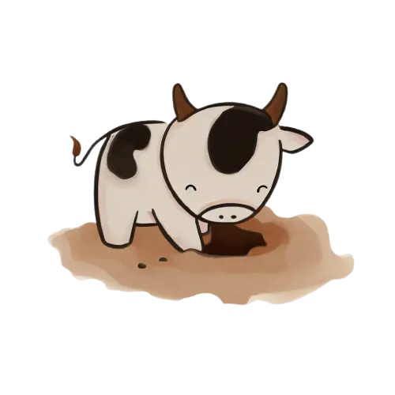

# Vaca cava vala

Inspirado por [WORDWARD DRAW by Daniel Linssen](https://managore.itch.io/wordward-draw)

Neste jogo você precisa encontrar novas palavras a partir de uma anterior, mudando apenas uma letra ou a ordem das letras atuais, por exemplo:

\> VACA -> CAVA

\> VACA -> VALA

Sinais dicráticos são ignorados na verificação, mas você ainda precisa digitar a palavra corretamente, por exemplo:

\> MACA -> MAÇÃ

O objetivo final é encontrar todas as palavras que contêm imagem.
Pressione TAB dentro do jogo para ver as imagens já encontradas.

Palavras shiny são palavras que não estão no dicionário mas eu quis colocar, por isso elas são mais difíceis.

# Download

[Windows](https://github.com/daviirodrig/vaca-cava-vala/releases/download/v1.0/vacacavavala.exe)

[Linux](https://github.com/daviirodrig/vaca-cava-vala/releases/download/v1.0/vacacavavala.linux.x86_64)

